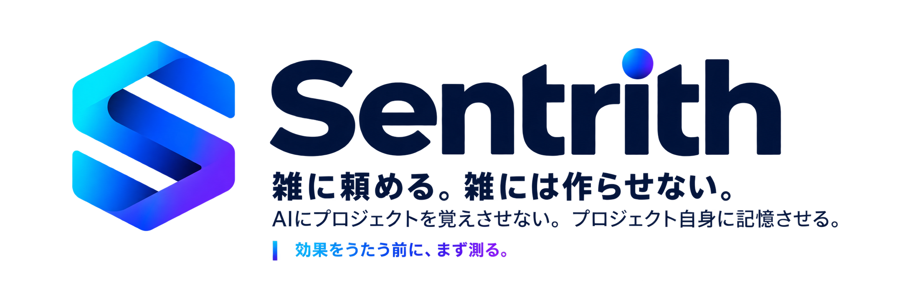
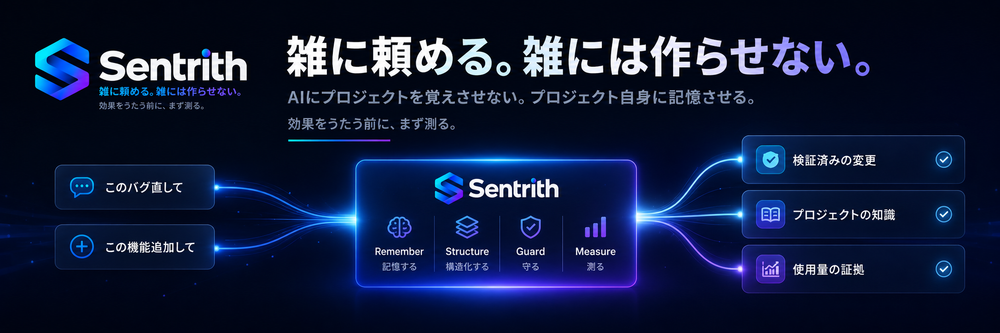
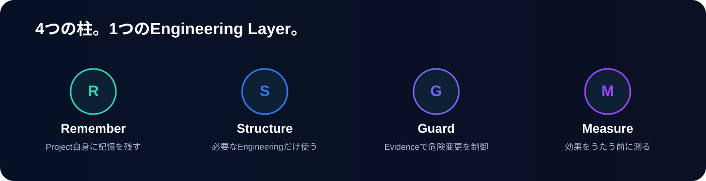
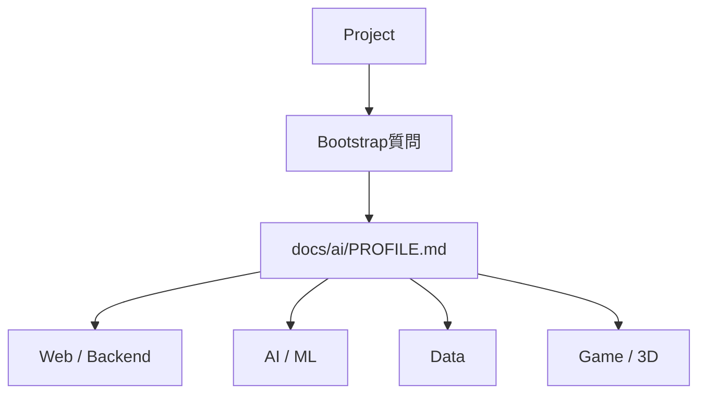

<p align="right">
  <a href="README.md">English</a> ｜ <strong>日本語</strong>
</p>

# Sentrith

<p align="center"></p>

<p align="center">
  <strong>雑に頼める。雑には作らせない。</strong>
</p>

<p align="center">
  
  
  
  
  
  
</p>

**Sentrithは、Vibe Codingの軽さを保ったまま、その裏側をSoftware Engineeringに戻すvendor-neutralなEngineering Layerです。**

「このバグ直して」「この機能追加して」と普通に頼むだけ。  
Codex / Claude Code / GitHub Copilot / Geminiに、**Project Memory・適応型Engineering・Guardrails・Usage Measurement**を追加します。

> **AIにプロジェクトを覚えさせない。プロジェクト自身に記憶させる。**


<p align="center"></p>

---

## 入力はそのまま。裏側だけ強くする。

Sentrithの狙いは、Vibe Codingを重くすることではありません。  
**操作感は軽いまま、成果物に必要なEngineeringを足すこと**です。

---

## 4つの柱

<p align="center"></p>

---

## 普通のAI Codingとの違い

| 普通のAI Coding | Sentrith |
|---|---|
| 毎回repoを再調査 | **Project Memoryを読む** |
| 全タスク同じ進め方 | **Tiny / Normal / Significantで調整** |
| 手法を人間が選ぶ | **Profileから必要な技法を選ぶ** |
| 高影響変更もPrompt頼み | **Evidence / Safety Gates** |
| AI/MLもコードが動けば完了 | **Eval / baselineで検証** |
| Game/3DもUnit Test中心 | **Visual / Runtime / Platform検証** |
| 「コスト減った気がする」 | **実測して比較** |

---

## プロジェクトに合わせてEngineeringを選ぶ

Sentrithは「DDDを使いますか？」「CQRSにしますか？」とは聞きません。

bootstrap時に、失敗時の影響・外部contract・AI/Data/Platform依存・既存の検証手段を数問確認し、必要なProfileだけを有効化します。結果は `docs/ai/PROFILE.md` に一度だけ記録します。



Profileは排他モードではなく**加算的なoverlay**です。RAG付きAPIならWeb/BackendとAI/MLの両方を有効化し、両方に合致する変更は和集合で検証します。

対応領域:

- **Web / Backend**
- **AI / ML**
- **Data Science / Data Engineering**
- **Game / Interactive 3D**
  - Unity
  - VRChat
  - Godot
  - Unreal Engine

各Profileは**技法ゲート**を持ちます: DDD Lite / Full、Ports & Adapters、CQRS、Event Sourcing、Threat Modeling、Property-Based Testing、Golden Eval、Statistical Review、Data Contract Test、Visual Acceptance。

技法は文書化された適用条件を満たしたときだけ有効化し、迷う場合は適用しません。

**手法を使うことを目的にしない。問題に必要な手法だけ使う。**

[Engineering Profiles →](docs/profiles/README.ja.md)

---

## 分野ごとに「正しさ」の定義も変える

- **AI / ML** — baseline、Golden Eval、prompt/model/data provenance
- **Data Science** — reproducibility、leakage、dataset provenance
- **Game / 3D** — Scene、Asset、Visual、Runtime、Platform、Performance
- **VRChat** — Avatar / World、SDK validation、Performance Rank、PC / Android / iOS差

> **Unityで正しいだけでは、VRChatで正しいとは限らない。**

---

## 効果をうたう前に、まず測る

Sentrithは「AI使用量が減るはず」とは言いません。

Provider usageとtask結果を結び、**usage / successful task**でbaselineと比較します。

| **Usage / successful task** | **Rework** | **Success rate** |
|:---:|:---:|:---:|
| **計測中** | **計測中** | **計測中** |

> 比較可能なbaseline / Sentrith sampleが揃うまでは削減率を表示しません。

対象はCLIだけではありません。

- GitHub Copilot / VS Code
- Claude Code Desktop / IDE / CLI
- Codex App / IDE / CLI
- Geminiのdocumented usage surfaces

ProviderごとのAI Credits / USD / tokensはそのまま保持し、横断比較では各環境のbaseline比を使います。

<!-- SENTRITH-USAGE-BENCHMARK:BEGIN -->
### Local Benchmark

まだ公開用の削減率claimはありません。  
十分なbaseline / Sentrith実測が集まってからREADMEへ反映します。

**効果をうたう前に、まず測る。**
<!-- SENTRITH-USAGE-BENCHMARK:END -->

---

## Community Benchmark

有志ユーザーの実測も、raw dataを送らず匿名集約できます。

```bash
sentrith usage contribute --agent copilot --model "<model>"
```

prompt、repository名、customer名、source code、transcript、session IDはContributionへ含めません。

<!-- SENTRITH-COMMUNITY:BEGIN -->
### Community Benchmark

まだqualified contributionはありません。  
実測値が集まってから、**中央値・sample数・success rate**と一緒に公開します。
<!-- SENTRITH-COMMUNITY:END -->

---

## 普段の使い方は変えない

```text
このバグ直して
このAPI追加して
RAGの精度落ちてないか確認して
Quest版だけ重い原因調べて
```

必要なときだけ裏側で:

```text
Project context
→ Risk / Scope
→ SPEC / Test / Eval
→ Safety Gates
→ Implementation
→ Verification
→ Project Memory
```

へ進みます。

---

## 1タスクではこう動く

開始方法はこれまで通りです。

```text
login timeout bugを直して。
```

通常のbug fixなら、概ね次の流れです。

```text
必要なProject Memoryを読む
→ 同じturn内でRisk / Scopeを分類
→ 狭い成功条件を決める
→ 再現 / focused check
→ 実装
→ Verification
→ Durable knowledgeが変わった場合だけProject Memory更新
```

通常はclassifier / reviewer / memory専用Agentを別に起動しません。

---

## 5分で始める

### 1. Repository Contractをコピー

Sentrith releaseを展開したdirectoryから実行します。

**macOS / Linux**

```bash
./scripts/install.sh /path/to/your-project
```

**Windows PowerShell**

```powershell
./scripts/install.ps1 -Target C:\path\to\your-project
```

### 2. Project MemoryをBootstrap

対象repositoryでCoding Agentへ依頼します。

```text
docs/ai/BOOTSTRAP.md を読んで、このrepositoryのbootstrapを実行して。
Applicationの挙動は変更しないで。
```

一度だけ `docs/ai/PROJECT.md` と `docs/ai/STATE.md` をReviewします。

### 3. あとは普通に頼む

```text
このバグ直して。
```

Optional CLIを入れた場合は確認できます。

```bash
sentrith preflight
sentrith guard
```

効果を測る場合は、workflow変更**前**にbaselineを取ります。

### 導入済みprojectを更新する

```bash
./scripts/install.sh --update /path/to/your-project
```

```powershell
./scripts/install.ps1 -Target C:\path\to\your-project -Update
```

`--update` はContract fileだけを置換し、**Project Memory(`docs/ai/PROJECT.md` 等)とfeature specは保持します**。

`--force` はProject Memoryごと上書きするため、更新には使わないでください。

[Installation →](docs/guide/INSTALLATION.ja.md) ｜ [Updating →](docs/guide/UPDATING.ja.md)

対応Agent:

- OpenAI Codex
- Claude Code
- GitHub Copilot
- Gemini
- repository contractを読めるその他Agent

---

## 詳細

- [やりたいことから探す](docs/README.ja.md)
- [Installation](docs/guide/INSTALLATION.ja.md)
- [Updating](docs/guide/UPDATING.ja.md)
- [Quickstart](docs/guide/QUICKSTART.ja.md)
- [Development Method](docs/development/DEVELOPMENT_METHOD.md)
- [Safety Gates](docs/development/SAFETY_GATES.md)
- [Usage Measurement](docs/metrics/MEASUREMENT_ARCHITECTURE.ja.md)
- [Community Benchmark](docs/metrics/COMMUNITY_BENCHMARK.ja.md)
- [Game / Interactive 3D](docs/profiles/GAME_INTERACTIVE_3D.ja.md)
- [VRChat Profile](docs/profiles/VRCHAT.ja.md)
- [Sentrith CLI](docs/automation/SENTRITH_CLI.ja.md)
- [Contributing](CONTRIBUTING.ja.md)

---

## Sentrithが目指すもの

AI Codingはもう十分速い。

次に必要なのは、もっと長いPromptではなく、**その速さを維持したまま、知識・安全性・検証・測定を開発プロセスへ戻すこと**です。

> **雑に頼める。雑には作らせない。**

---

**Sentrith v0.2.0** — 0.x系列。Contractは今後も変わります。[Versioning](docs/meta/VERSIONING.md) を参照してください。
