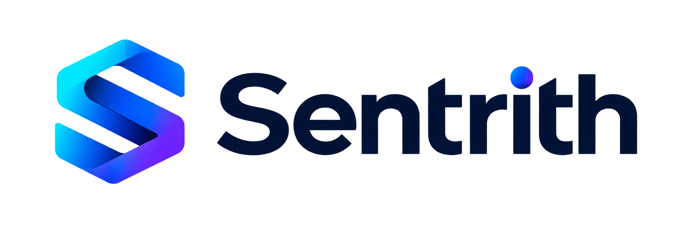
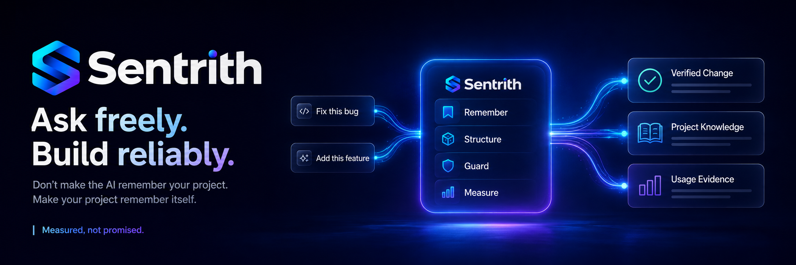
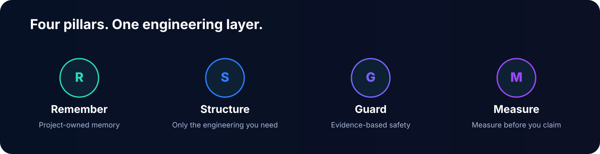
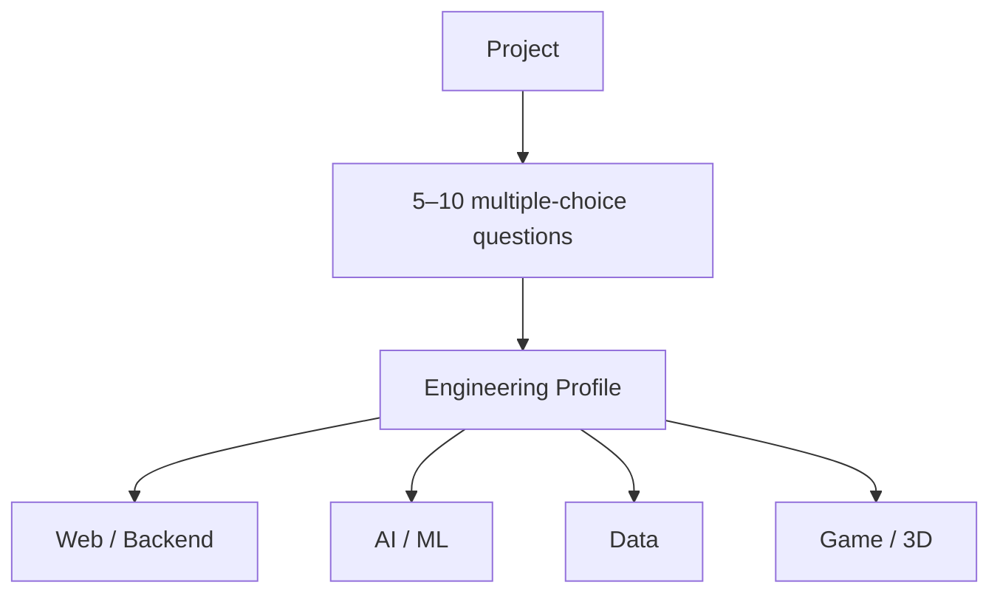

<p align="right">
  <strong>English</strong> ｜ <a href="README.ja.md">日本語</a>
</p>

# Sentrith

<p align="center"></p>

<p align="center">
  <strong>Ask freely. Build reliably.</strong>
</p>

<p align="center">
  
  
  
  
  
  
</p>

<p align="center">
  
</p>

**Sentrith is a vendor-neutral Engineering Layer that keeps the low-friction UX of Vibe Coding while bringing Software Engineering back behind it.**

Ask naturally: “Fix this bug.” “Add this feature.”  
Sentrith adds **Project Memory, adaptive Engineering, Guardrails, and Usage Measurement** to Codex, Claude Code, GitHub Copilot, and Gemini.

> **Don’t make the AI remember your project. Make your project remember itself.**

---

## What changes?

| Ordinary AI Coding | With Sentrith |
|---|---|
| Re-investigate the repo every time | **Read Project Memory** |
| Same workflow for every task | **Adjust by Risk / Scope** |
| Humans choose methodologies up front | **Select only the Engineering the project needs** |
| High-impact changes rely on prompts | **Evidence / Safety Gates** |
| AI/ML is done when code runs | **Validate with evals / baselines** |
| Game/3D is judged mostly by unit tests | **Visual / Runtime / Platform verification** |
| “Feels cheaper” | **Measure the actual change** |

Sentrith is built around four pillars:

<p align="center"></p>

---

## Use only the Engineering you need

Sentrith does not start by asking:

> “Do you want DDD?”  
> “Should we use CQRS?”

Instead, it asks a small number of project questions about complexity, failure impact, AI/Data/Platform dependencies, and hard-to-test areas.



Supported areas include:

- **Web / Backend**
- **AI / ML**
- **Data Science / Data Engineering**
- **Game / Interactive 3D**
  - Unity
  - VRChat
  - Godot
  - Unreal Engine

Techniques such as DDD Lite / Full, Threat Modeling, Property-Based Testing, Ports & Adapters, Statistical Review, Visual Regression, Formal Methods, CQRS, and Event Sourcing are enabled only when they fit the actual problem.

**The technique is not the goal. Solving the project’s real risk is.**

---

## “Correct” means different things in different domains

- **AI / ML** — baselines, Golden Eval, prompt/model/data provenance
- **Data Science** — reproducibility, leakage, dataset provenance
- **Game / 3D** — Scene, Asset, Visual, Runtime, Platform, Performance
- **VRChat** — Avatar / World, SDK validation, Performance Rank, PC / Android / iOS differences

> **Correct in Unity is not necessarily correct in VRChat.**

---

## Measure before you claim

Sentrith does not claim that AI usage “should” go down.

It joins Provider usage with task outcomes and compares **usage / successful task** against a baseline.

| **Usage / successful task** | **Rework** | **Success rate** |
|:---:|:---:|:---:|
| **Collecting** | **Collecting** | **Collecting** |

> No reduction claim is shown until comparable baseline and Sentrith samples exist.

Measurement is not CLI-only.

- GitHub Copilot / VS Code
- Claude Code Desktop / IDE / CLI
- Codex App / IDE / CLI
- Gemini through documented usage surfaces

Provider-native units stay native: AI Credits, USD, or tokens. Cross-provider aggregation uses each environment’s baseline-relative change.

<!-- SENTRITH-USAGE-BENCHMARK:BEGIN -->
### Local Benchmark

No public reduction claim yet.  
Measured baseline / Sentrith data will be published here once enough comparable samples exist.

**Measured, not promised.**
<!-- SENTRITH-USAGE-BENCHMARK:END -->

---

## Community Benchmark

Real users can contribute anonymized aggregate measurements without sending raw data.

```bash
sentrith usage contribute --agent copilot --model "<model>"
```

Prompts, repository names, customer names, source code, transcripts, and session IDs are excluded from contribution files.

<!-- SENTRITH-COMMUNITY:BEGIN -->
### Community Benchmark

No qualified contributions yet.  
Once measurements arrive, Sentrith will publish **medians, sample sizes, and success rates** together.
<!-- SENTRITH-COMMUNITY:END -->

---

## Keep using AI the way you already do

```text
Fix this bug.
Add this API.
Check whether RAG quality regressed.
Find out why the Quest build got slower.
```

When needed, Sentrith adds structure behind the scenes:

```text
Project context
→ Risk / Scope
→ SPEC / Test / Eval
→ Safety Gates
→ Implementation
→ Verification
→ Project Memory
```

---

## What one task looks like

You still start with a normal request:

```text
Fix the login timeout bug.
```

For an ordinary bug fix, the expected flow is roughly:

```text
Read relevant Project Memory
→ classify Risk / Scope in the current turn
→ define the narrow success condition
→ reproduce / add a focused check
→ implement
→ verify
→ update Project Memory only if durable knowledge changed
```

No separate classifier, reviewer, or memory agent is required by default.

---

## Start in 5 minutes

### 1. Copy the repository contract

From an extracted Sentrith release:

**macOS / Linux**

```bash
./scripts/install.sh /path/to/your-project
```

**Windows PowerShell**

```powershell
./scripts/install.ps1 -Target C:\path\to\your-project
```

### 2. Bootstrap Project Memory

In the target repository, ask your coding agent:

```text
Read docs/ai/BOOTSTRAP.md and perform the bootstrap for this repository.
Do not change application behavior.
```

Review `docs/ai/PROJECT.md` and `docs/ai/STATE.md` once.

### 3. Work normally

```text
Fix this bug.
```

If the optional CLI is installed, verify the setup:

```bash
sentrith preflight
sentrith guard
```

Want to measure impact? Record a baseline **before** changing your workflow.

[Full installation guide →](docs/guide/INSTALLATION.en.md)

Works with:

- OpenAI Codex
- Claude Code
- GitHub Copilot
- Gemini
- other repository-aware agents

---

## Learn more

- [Documentation by goal](docs/README.md)
- [Installation](docs/guide/INSTALLATION.en.md)
- [Quickstart](docs/guide/QUICKSTART.en.md)
- [Development Method](docs/development/DEVELOPMENT_METHOD.md)
- [Safety Gates](docs/development/SAFETY_GATES.md)
- [Limitations](docs/guide/LIMITATIONS.en.md)
- [Usage Measurement](docs/metrics/MEASUREMENT_ARCHITECTURE.en.md)
- [Community Benchmark](docs/metrics/COMMUNITY_BENCHMARK.en.md)
- [Game / Interactive 3D](docs/profiles/GAME_INTERACTIVE_3D.en.md)
- [VRChat Profile](docs/profiles/VRCHAT.en.md)
- [Sentrith CLI](docs/automation/SENTRITH_CLI.en.md)
- [Contributing](CONTRIBUTING.md)

---

## What Sentrith is trying to do

AI Coding is already fast.

The next step is not a longer prompt. It is to **keep the speed while bringing knowledge, safety, verification, and measurement back into the development process**.

> **Ask freely. Build reliably.**

---

**Sentrith v1.0.0 — first public release.**
